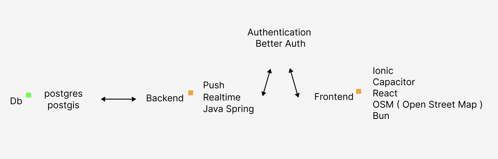

# Figma
We will use schematic diagrams to represent the architecture, functional concepts, and design language.
## Link
https://www.figma.com/design/fz72DpPjBddKwdlETfz7CU/Map-Proyect?node-id=0-1&t=eUCLzz7zkhfUwinM-1
## Example

